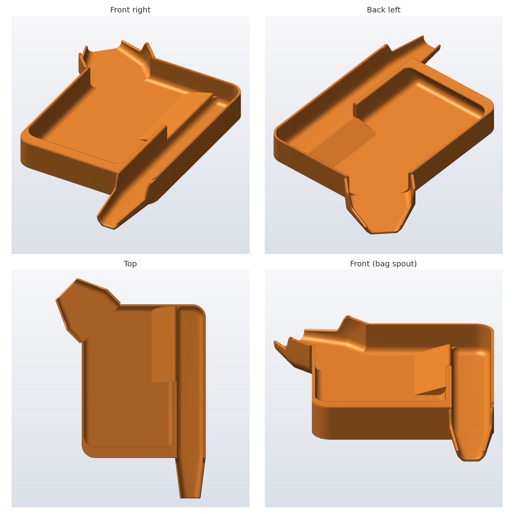

# Screw Counting Tray

A 3D-printable tray for counting small parts (screws, nuts, washers) and bagging them.



## How to use it

1. Dump the parts into the large well.
2. Count them by pushing them up the ramp and over the low ridge into the side channel.
3. Tip the tray forward to pour the counted parts out of the narrow spout into a small bag.
4. Tip it toward the back-left corner to pour the leftovers back into their bin.

The front half of the ridge is a full-height wall, and the well's front wall leans inward. Together they keep uncounted parts in the well while you pour the counted ones.

## Print it

`SmallPartsTray.stl` is ready to slice. It measures about 93 × 115 × 18 mm, or 113 × 165 mm including the spouts.

- No supports needed: every overhang is 45° or less from vertical.
- Print it flat on the bed, as exported.
- It weighs about 55 g in PLA at 100% infill, less at normal infill.

## Customize it

The design is generated by `small_parts_tray.py`, a Python script. All dimensions (in mm) are set as parameters at the top of the file. Common ones to change:

| Parameter | Default | What it does |
|---|---|---|
| `L`, `W`, `H` | 93, 115, 18 | Overall length, width and wall height |
| `RIDGE_H` | 5 | Ridge height above the floor; use 3–4 for tiny M1.6–M2 screws |
| `RAMP_L` | 16 | Length of the ramp up to the ridge |
| `WALL_FRAC` | 0.5 | How much of the ridge (from the bag-spout end) is a full-height wall |
| `GUTTER_W` | 20 | Width of the counted-parts channel |
| `BAG_SPOUT_EXIT` | 12 | Width of the bag spout's opening |
| `BAG_SPOUT_LEN` | 32 | Length of the bag spout |
| `LEAN_DEG` | 35 | How far the front wall leans inward; keep it at 45° or less to print without supports |

To regenerate the STL:

```bash
python3 -m venv .venv
.venv/bin/pip install -r requirements.txt
.venv/bin/python small_parts_tray.py        # writes SmallPartsTray.stl
.venv/bin/python render_views.py SmallPartsTray.stl tray_views.png   # the 4-view image above
.venv/bin/python preview.py SmallPartsTray.stl tray_check.png        # height map and cross-sections
```

## Credits

The ramp-and-ridge idea and the corner pour spout were inspired by two existing sorting-tray designs (a large-parts sorting tray and "Sorting Tray V2"). Neither original file is included here.

## License

[CC BY-NC-SA 4.0](LICENSE): you may share and adapt this design with credit, but not for commercial use, and you must share any changes under the same licence.
